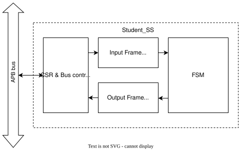

# Image processing accelerator with CPU data transport

This laboratory exercise extends the existing image processing accelerator lab by integrating it into the Didactic-SoC and introducing data transport between the CPU, accelerator, and UART peripheral.

The goal is to expose students to memory-mapped hardware modules, a simple SoC architecture, and hardware–software co-design.

## Software requirements

1. Make
2. Questa Starter Edition [Link to download](https://www.altera.com/downloads/simulation-tools/questa-fpgas-standard-edition-software-version-25-1)
3. riscv32-unknown-elf toolchain
4. Vivado
5. Python 3 with `pyserial`, `Pillow`, and `appJar` packages (`python3-tk` also required)
6. (Optional) OpenOCD for JTAG debugging

🔴 TODO:  Add guides how to install everything

[Questa Quick-Start Guide](https://www.intel.com/programmable/technical-pdfs/703090.pdf)
## Overview

🔴 TODO:  Add overview of Didactic-SoC

The Student Sub-System in `src/rtl/Student_area_0.sv` contains a simple pixel inversion accelerator. 

The accelerator consists of input and output buffers (implemented as BRAM), a control/status register (CSR), APB bus handling, and a processing FSM that performs pixel inversion.



The CPU controls the accelerator and performs the following steps:

1. Receive image data via **UART** and copy it to the accelerator **input buffer**.
2. Set the **DATA_READY** bit in the CSR to start processing.
3. Poll the **DONE** bit in the CSR.
4. When processing is complete (**DONE = 1**), send the processed image back via **UART**.

In the real-world test on an FPGA, the image will be sent from a PC over UART, processed by the SoC, and returned to the PC. The testbench mirrors this flow: it acts as the PC, sending the image over UART and receiving the result, which it then saves as a `.pgm` file for visual inspection.

The generated `.pgm` file can be viewed using software such as **IrfanView** or any image viewer that supports the PGM format.


## Tasks
### 0.  Test the Didactic-SoC with a Working Example

This task is meant for testing if you have correctly installed the required software and also to familiarize yourself with the SoC and the make automation that is used in the project. 

Firstly, compile C code by running the following make command from project root directory `02203-Didactic-SoC/`
```
make build_test TEST=pixel_inversion
```

🔴 TODO: Add bender dependencies to repo so students don't have to install it

Try to run a testbench in batch mode with

```
make test_ss
```

This will run `src/tb/tb_student_ss.sv` testbench that simulates the standalone `Student_area_0` module. 

The testbench reads an input PGM (set by the `src_image` parameter), drives the accelerator via an [APB](https://developer.arm.com/documentation/ihi0024/latest/) interface, and writes the processed result to a new PGM which can be found in `src/tb/out_images/`.

You can also run the testbench with GUI, which will be useful when debugging your design
```
make test_ss_gui
```

---

### 1.  Develop the Edge Detection Accelerator

#### Architecture consideration
Before writing any RTL code, you need a design. You need
to understand the problem and consider possible implementations.

...

Draw a block diagram showing the datapath you have designed and develop an ASMD chart specification of your design.

#### RTL design

Using your ASMD chart and block diagram, implement the edge detection accelerator in RTL. Write your code in `src/rtl/Student_area_0.sv`, replacing the pixel inversion logic from Task 0.

To test your design, run the following command from the project root:

```
make test_ss
```

This testbench is meant for verifying your edge detector design before system integration.


### 2.  Integrate the Accelerator into the SoC

Once your RTL design works correctly with the standalone testbench, you may test the design with the entire system.

The testbench can be found in `src/tb/tb_didactic_V1.sv`. The simulation is meant to replicate the real test that will be done on the FPGA with UART data coming from a PC.

The testbench simulates the PC-side UART transceiver. To facilitate UART transactions the testbench implements two tasks: `uart_write_byte` and `uart_receive_byte`.

Note 1: Instead of the real UART peripheral, a simplified model is used to speed up simulation.
Note 2: The processed image is read directly from the accelerator output buffer, skipping the UART writeback to the testbench, to save simulation time.

**Task: Review the testbench `src/tb/tb_didactic_V1.sv`** 

The CPU C code:
1. Initializes the 0th Student Subsystem
2. Initializes the UART peripheral
3. Configures the UART peripheral for desired operation
4. Sets the accelerator ibuf address to 0
5. Collects 4 bytes from UART and then writes to the accelerator ibuf
6. After the full ibuf has been written polls the CSR_DONE bit in the accelerator

**Task: Review the C code `sw/pixel_inversion/pixel_inversion.c`** 


Build the C code to produce a .hex file that can be used to initialize the instruction memory of the CPU:
```
make build_test TEST=pixel_inversion
```
For curiosity or debugging purposes you may look at the assembly dump in `build/sw/pixel_inversion.asm`.

Run the full Didactic-SoC simulation with
```
make test_all TEST=pixel_inversion 
``` 
To run with GUI:
```
make test_all_gui TEST=pixel_inversion 
```
This simulation will take about 18 mins in batch mode and more with GUI mode. 

Even though a simplified UART model is used, it takes 20 cycles to send 1 byte (2 cycles per bit, including start and stop bits). The test transfers 101376 bytes (352×288 pixels), which equates to 101376×20 = 2.03e6 cycles. With each cycle taking 10 ns (100 MHz), the test covers 20.3 ms of simulation time.
On an Ubuntu laptop using the Questa Starter Edition, this took approximately 18 minutes in batch mode.

### 3.  FPGA Implementation

To test the system you will send an image from your computer to the Didactic-SoC and receive the processed image back. The steps are:

1. A computer sends an image to the FPGA via UART.
2. The CPU forwards the pixel data to the accelerator IBUF.
3. The accelerator processes the image.
4. The CPU sends the processed image back to the PC through UART.

Compile the code for FPGA with the following make target from `fpga/`

```
make build_test TEST=pixel_inversion
```
Note: There are two CPU programs - one in `sw/` for simulation and another in `fpga/sw/` for the FPGA implementation, which is intended to work with the Python GUI on the PC side.

Synthesize and implement the design using **Vivado**. This can be done by running
```
make fpga PROJECT=nexys_a7
```
If synthesis errors occur, check your RTL code for **unsynthesizable constructs**.

To open the Vivado project with the GUI - launch Vivado then choose "Open Project" and select `build/fpga/nexys_a7/didactic-nexys_a7.xpr` file.

### 4. Program and debug over JTAG (Optional)

To upload code to the CPU in the Didactic-SoC, first start an OpenOCD server. OpenOCD acts as a bridge between the GNU Debugger (GDB) and the physical JTAG interface.

```
openocd -f fpga/utils/openocd-didactic-nexys.cfg
```

Then from `fpga/`, upload the program with
```
make load_elf TEST=pixel_inversion
```

...


# Draft space (old stuff)

#### Student Task

Extend the provided CPU software so that it:

1. Receives an image from the computer via UART and stores it in DMEM (use the provided function - `UART_read_from_pc()`).
2. Transfers the image data from DMEM to the accelerator input buffer and starts the accelerator.
3. Waits until the accelerator signals that processing is complete.
4. Transfers the processed data from the accelerator output buffer back to DMEM.
5. Sends the processed image back to the computer via UART (use the provided function - `UART_write_to_pc()`).

---


## Notes
* Don't do pixel checking in testbench. Because the students might do different implementations. If they want to check pixels that's fine otherwise we don't care about the most precise result.


## Steps
0. Give a working blinky example for testing all the tools
0. Implement a bus-connected frame buffer in the Didactic-SoC Student SS. Test with given testbench
2. Integrate frame buffer
Could also do pixel inversion, then have a status register which would indicate to the CPU the state of the peripheral (IDLE, RUNNING, DONE).
2. Verify buffer operation by writing a small C program which would move a frame from DMEM to the new peripheral, wait for it to process, then write back to another part of memory.
3. Develop accelerator (ACC) in isolation (we provide testbench).
4. Integrate accelerator in the SoC. Use the simple design from milestone1 to attach the accelerator to the system.
5. Adjust CPU software - once the image processing is done it writes the result to UART instead of back to memory.
6. Test the full system on an FPGA. Students run their program to process an image stored in memory. The processed output is transmitted via UART and displayed on a PC using a provided application.
7. Design improvement (Advanced tasks)
Improve the system performance and utilization. This could be done by:
* Improve the accelerator. For example to buffer multiple lines instead of the whole frame, then pipeline CPU transfers with accelerator execution:
```
CPU writes new data 
while 
accelerator processes previous data.
```


Extend the provided code so that once a full image has been loaded into DMEM the CPU moves the image into the accelerator and once processing is done call the `UART_write_image(uint32_t pic_start_addr)` function to send the image back to the PC.