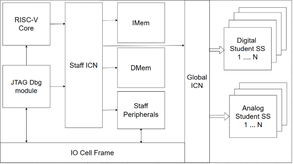

#####################################
The Didactic SoC platform [#fIMT]_
#####################################

The Didactic SoC platform [#fDidacticsoc]_ is the baseline SoC template for Edu4Chip.
It offers a microcontroller-scale open-source platform for education.
The SoC was developed based on principles of simplicity, extendability, reusability, and ease of integration.

********************************
Specification
********************************

The Didactic SoC architecture was designed around two distinct functional sections: the management section, also called the staff section, and the student sections in which student subsystems are integrated.
These sections are highlighted in :numref:`soc-architecture`: the management section on the left of the figure is connected through a global interconnect network (ICN) to the student subsystems (SS) on the right of the figure.
Student sections integrate custom subsystems with a well-defined interface that can be individually selected.
The generic interface of the subsystems is described in :ref:`student-subsystems`.

.. _soc-architecture:

   Block diagram of the Didactic SoC architecture.

The staff section of the chip offers:

- a RISC-V Ibex [#fIbex]_ processor core that implements the RV32IMC instruction set architecture
- a debug module accessible over JTAG from the PULP open source project [#fPULP]_ which is compliant with the RISC-V Debug Specification
- one 16 KiB SRAM instruction memory (``IMEM``) and one 16 KiB SRAM data memory (``DMEM``)
- a set of external peripherals (UART, SPI) from the PULP project [#fPULP]_ to communicate with the SoC
- a peripheral interface to up to five freely customisable submodules
- dedicated circuitry that controls subsystem reset and clock enable on one hand, and configures the connection of the subsystems to the pads of the SoC on the other

The initial specification targets the GF 22 nm ASIC technology from Europractice with a maximum frequency of 100 MHz and a maximum area of 2.5 mm² for both the staff section and the student subsystems.
The system provides 16 GPIO connections and SPI and UART peripherals.
The core and IO voltages are determined by the technology node: 0.8 V for the core and 1.2 V / 1.5 V / 1.8 V for the IOs, which requires the test PCB to use level shifters compatible with 3.3 V peripheral modules.

The above specifications are summarized in :numref:`tab-soc-specs`.

.. _tab-soc-specs:
.. list-table:: Didactic SoC technical specifications
   :header-rows: 1
   :widths: 35 65

   * - Parameter
     - Value
   * - Technology node
     - GF 22nm FDX (Europractice)
   * - Maximum frequency
     - 100 MHz
   * - Maximum area
     - 2.5 mm² (staff section + student subsystems)
   * - Core voltage
     - 0.8 V
   * - IO voltage
     - 1.2 V / 1.5 V / 1.8 V
   * - CPU core
     - RISC-V Ibex, RV32IMC ISA
   * - Instruction memory
     - 16 KiB SRAM
   * - Data memory
     - 16 KiB SRAM
   * - Debug interface
     - JTAG (RISC-V Debug Specification)
   * - GPIO
     - 16 pins
   * - Serial interfaces
     - UART, SPI
   * - Student subsystem slots
     - Up to 5
   * - Student subsystem bus
     - APB

Pinout
------

The students IPs and peripherals of the Didactic SoC require 32 IO pins.
On top of these, analog student subsystems can have their own IO pins.
The digital IO connections are routed through a centralized module to handle instantiation of technology specific cells.
The rest of the SoC IO area is filled with power and ground connections during the physical implementation stage.

IP-XACT model
-------------

IP-XACT is an IP exchange format implemented using XML.
It is specified in the IEEE-1685 standard and managed by Accelera.
This format enables designers to capture structural descriptions, memory content and information pertaining to design files and documentation.
The XML description allows in turn to describe design information in a standardized, tool-friendly format.
Didactic platform uses the Kactus2 Graphical User Interface to represent and manipulate the IP-XACT description of the SoC.

Dependency management
---------------------

This SoC depends on open-source implementations provided by developers at various repositories, primarily on GitHub under the OpenHW Group [#fOpenowgroup]_ and PULP Platform [#fPULP]_.
These reused hardware modules reference specific commits or tags to track the version of each dependency that corresponds to a given release of the Didactic SoC.
Both the Didactic SoC and PULP Platform modules depend on the same bus-specific modules, which leads to the traditional dependency management challenge in hardware development.

This challenge can be addressed in various ways, such as monolithic repositories that copy dependencies inline, or through the use of git submodules that always point to a specific version of a repository.
The former makes it difficult to update modules while crediting their authors, and the latter leads to inflexible repository structures.
During module development this is not usually a roadblock, but whenever an additional developer joins the project, it tends to cause issues when building consistent development environments across partners.

To facilitate managing repositories at multiple levels in hardware projects, the PULP Platform developed a tool called Bender [#fBender]_.
It uses a YAML configuration file to represent project dependencies and enforce a specific project structure for submodules.
It is then able to resolve dependency chains of all submodules that use the same structure.
This mechanism allows the top-level project to easily fetch third-party IPs and manage the versions of the submodules.

********************************
Memory and bus architecture
********************************

Bus architecture
----------------

The Didactic SoC bus architecture was designed to be both topology- and type-agnostic.
The only requirement is that the bus type must be addressable to expose peripherals and subsystems through a unified memory map.
IP-XACT modules were used to keep track of bus types and memory-mapped components.

The SoC was first developed using the AXI4LITE ARM AMBA protocol for high-speed bus communication, before switching to the open-source OBI protocol standardised by the OpenHW Group for the taped-out version of the SoC.
An OBI-to-APB bridge is used to simplify the interface of the student subsystems.

The SoC bus is currently implemented as two hierarchically separated layers of fully connected crossbars in the global interconnect network (ICN).
The first layer routes connections to all submodules of the staff section, and the second layer manages CPU access to the student subsystems.

Memory organisation
-------------------

System memory map
^^^^^^^^^^^^^^^^^

The memory address layout of the soC is given in :numref:`system-memory-layout`.
The SoC memory is partitioned across modules, each occupying a fixed address range in the 32-bit address range.
The address space was not manually packed.

.. _system-memory-layout:

.. list-table:: System memory layout
   :header-rows: 1
   :widths: auto

   * - System
     - Base Address
   * - Instruction memory
     - 'h01000000
   * - Data memory
     - 'h01010000
   * - Debug module
     - 'h01020000
   * - Peripherals
     - 'h01030000
   * - Control registers
     - 'h01040000
   * - Student subsystems
     - 'h01050000

Peripheral memory map
^^^^^^^^^^^^^^^^^^^^^

The memory address layout of the SoC peripherals is given in :numref:`peripheral-memory-layout`.

.. _peripheral-memory-layout:

.. list-table:: Peripheral memory layout
   :header-rows: 1
   :widths: auto

   * - Peripheral
     - Base Address
   * - GPIO
     - 'h01030000
   * - UART
     - 'h01030100
   * - SPI
     - 'h01030200

Student subsystems memory map
^^^^^^^^^^^^^^^^^^^^^^^^^^^^^

The memory address layout of the available slots for student subsystems is given in :numref:`ss-memory-layout`.

.. _ss-memory-layout:

.. list-table:: Student subsystems memory layout
   :header-rows: 1
   :widths: auto

   * - Student subsystem
     - Base Address
   * - SS0
     - 'h01050000
   * - SS1
     - 'h01060000
   * - SS2
     - 'h01070000
   * - SS3
     - 'h01080000
   * - SS4
     - 'h01090000

********************************
Debug Support
********************************

Debug access is one of the standard access modes on a SoC, as an alternative to independent or guided boot.
In the Didactic SoC, it is used as the sole boot option for simplicity.

JTAG debug interface
--------------------

JTAG is an IEEE standard that defines SoC access through a dedicated serial interface.
The debug module connected to this interface accepts commands from a host PC.
This allows standard tools such as GDB to control the SoC.

Device programming
------------------

Device programming is performed in C.
The repository includes generic helper functions in header files to support rapid development of test and application code.

Boot sequence
-------------

The first iteration of the SoC does not have an independent boot capability.
It is fully externally controlled via JTAG.
The boot sequence is as follows:

1. SoC is connected to host PC via USB
2. SoC is lifted from reset
3. OpenOCD takes control of debug module via JTAG through ftdi-module

A) Manual operation through commands:

   4. Connection is established through RISC-V gdb
   5. RISC-V gdb is used to control SoC with direct commands

B) Programming flow:

   4. Baremetal program is compiled using RISC-V toolchain
   5. RISC-V gdb is used to control the SoC and preload instruction memory
   6. RISC-V gdb lifts core from halt
   7. Core reads instruction memory and starts program execution

Later iterations of the Didactic SoC may include an independent boot mode, in which the core would start from a program stored in ROM.

**********************
Controller
**********************

The controller block (``SS_Ctrl_reg_array``) is the central control register bank mapped at base address ``0x01040000``.
It manages CPU fetch enable, subsystem reset and clock gating, PMOD routing, and IO cell pad configuration.
The complete register map is given in :numref:`tab-ctrl-regs`.

.. _tab-ctrl-regs:
.. list-table:: Controller register map (base address ``0x01040000``)
   :header-rows: 1
   :widths: 35 15 50

   * - Register name
     - Offset
     - Description
   * - ``fetch_en``
     - ``0x000``
     - Ibex CPU instruction-fetch enable
   * - ``ss_rst``
     - ``0x004``
     - Subsystem and ICN reset control (active-high)
   * - ``icn_ss_ctrl``
     - ``0x008``
     - ICN subsystem control word
   * - ``ss_0_ctrl``
     - ``0x00C``
     - Subsystem 0 clock and IRQ control
   * - ``ss_1_ctrl``
     - ``0x010``
     - Subsystem 1 clock and IRQ control
   * - ``ss_2_ctrl``
     - ``0x014``
     - Subsystem 2 clock and IRQ control
   * - ``ss_3_ctrl``
     - ``0x018``
     - Subsystem 3 clock and IRQ control
   * - ``ss_4_ctrl``
     - ``0x01C``
     - Subsystem 4 clock and IRQ control
   * - ``ss_ctrl_reserved_1``
     - ``0x020``
     - Reserved for a future subsystem slot
   * - ``pmod_sel``
     - ``0x024``
     - PMOD connector host-selection mux
   * - ``io_cell_cfg_0``
     - ``0x028``
     - IO cell configuration for the UART RX pad
   * - ``io_cell_cfg_1``
     - ``0x02C``
     - IO cell configuration for the UART TX pad
   * - ``io_cell_cfg_2``
     - ``0x030``
     - IO cell configuration for the SPI SCK pad
   * - ``io_cell_cfg_3``
     - ``0x034``
     - IO cell configuration for the SPI CSN0 pad
   * - ``io_cell_cfg_4``
     - ``0x038``
     - IO cell configuration for the SPI CSN1 pad
   * - ``io_cell_cfg_5``
     - ``0x03C``
     - IO cell configuration for the SPI DATA0 pad
   * - ``io_cell_cfg_6``
     - ``0x040``
     - IO cell configuration for the SPI DATA1 pad
   * - ``io_cell_cfg_7``
     - ``0x044``
     - IO cell configuration for the SPI DATA2 pad
   * - ``io_cell_cfg_8``
     - ``0x048``
     - IO cell configuration for the SPI DATA3 pad
   * - ``io_cell_cfg_9`` – ``io_cell_cfg_24``
     - ``0x04C`` – ``0x088``
     - IO cell configuration for GPIO[0]–GPIO[15] pads
   * - ``return_reg_0``
     - ``0x100``
     - Post-main idle-loop instruction word 0
   * - ``return_reg_1``
     - ``0x104``
     - Post-main idle-loop instruction word 1
   * - ``boot_reg_0``
     - ``0x180``
     - Boot idle-loop instruction word 0
   * - ``boot_reg_1``
     - ``0x184``
     - Boot idle-loop instruction word 1

The register fields are described below.

``fetch_en`` (offset ``0x000``)

- ``fetch_en_reg`` [3:0] — Ibex instruction-fetch enable. Reset value ``0x5``. Write a non-zero value to enable instruction fetch; write ``0x0`` to halt the CPU.

``ss_rst`` (offset ``0x004``)

- ``icn_rst`` [0] — ICN reset. Write ``1`` to hold the interconnect in reset; write ``0`` to release it.
- ``ss_0_rst`` [1] — Subsystem 0 reset. Write ``1`` to hold SS0 in reset; write ``0`` to release.
- ``ss_1_rst`` [2] — Subsystem 1 reset. Write ``1`` to hold SS1 in reset.
- ``ss_2_rst`` [3] — Subsystem 2 reset. Write ``1`` to hold SS2 in reset.
- ``ss_3_rst`` [4] — Subsystem 3 reset. Write ``1`` to hold SS3 in reset.
- [31:5] — Reserved, write ``0``.

``icn_ss_ctrl`` (offset ``0x008``)

- ``icn_ctrl`` [30:0] — Control word forwarded to the ICN subsystem port. Currently unused by the ICN logic.

``ss_N_ctrl`` (offsets ``0x00C``–``0x01C``, one register per subsystem N = 0–4)

- ``ssN_clk_en`` [0] — Standard clock enable. Write ``1`` to gate the clock on for subsystem N.
- ``ssN_fast_clk_en`` [1] — Fast clock enable. Write ``1`` to enable the high-speed clock for subsystem N.
- [30:2] — Reserved, write ``0``.
- ``ssN_irq_en`` [31] — IRQ enable. Write ``1`` to route the subsystem N interrupt to the SoC interrupt controller.

``pmod_sel`` (offset ``0x024``)

- ``pmod_ctrl`` [7:0] — PMOD routing select. Write the subsystem index (0–3) whose GPIOs should be routed to the PMOD connector. Any value outside 0–3 routes the staff-section GPIOs instead. Reset value ``0x4`` (staff-section GPIOs active by default).

``io_cell_cfg_N`` (offsets ``0x028``–``0x088``, one register per IO pad)

Each register configures one IO pad; only bits [4:0] are connected to the IO cell. Reset value ``0x0D`` (``5'b01101``).

- ``dir`` [0] — Pad direction. ``0`` = output (pad driven from core); ``1`` = input (pad tristated, value sampled to core).
- [4:1] — Reserved for additional cell parameters (drive strength, slew rate, Schmitt trigger). Not connected in the simulation model.

``return_reg_0`` / ``return_reg_1`` (offsets ``0x100`` / ``0x104``)

- [31:0] — Two consecutive instruction words executed at the CPU program counter after ``main()`` returns. Both reset to ``0x6F`` (RISC-V ``JAL x0, 0``), so the CPU enters a safe self-loop after program completion.

``boot_reg_0`` / ``boot_reg_1`` (offsets ``0x180`` / ``0x184``)

- [31:0] — Two consecutive instruction words executed at boot before firmware is loaded over JTAG. Both reset to ``0x6F`` (``JAL x0, 0``), keeping the CPU in a safe idle state until the debugger preloads instruction memory and releases the core.

********************************
Peripherals
********************************

Peripheral modules are standard interface modules that interact with external devices.
They are reused from PULP Platform modules and are accessible at fixed hardware addresses.

GPIO
----

GPIOs are general-purpose IO signals that serve no dedicated function.
They can be used for a wide variety of purposes, such as reading sensor values or driving an LED.
They can interface with any external module that operates at relatively low speed.
The GPIOs are exposed on a PMOD connector, enabling connection to standard PMOD modules such as memories or audio devices.
Student subsystems that use these pins must implement their own behaviour and synchronization logic internally.
The Didactic SoC instantiates 16 GPIO pins (GPIO[15:0]); GPIO pad direction is controlled via the ``io_cell_cfg`` registers in the controller block.

.. _tab-gpio-regs:
.. list-table:: GPIO register map (base address ``0x01030000``)
   :header-rows: 1
   :widths: 33 15 52

   * - Register name
     - Offset
     - Description
   * - ``REG_PADDIR_00_31``
     - ``0x00``
     - Pad direction for GPIO[31:0]: ``1`` = output, ``0`` = input
   * - ``REG_GPIOEN_00_31``
     - ``0x04``
     - GPIO function enable for GPIO[31:0]: ``1`` enables the GPIO peripheral on that pad
   * - ``REG_PADIN_00_31``
     - ``0x08``
     - Sampled input values for GPIO[31:0] (read-only)
   * - ``REG_PADOUT_00_31``
     - ``0x0C``
     - Output values for GPIO[31:0]
   * - ``REG_PADOUTSET_00_31``
     - ``0x10``
     - Atomic set for GPIO[31:0]: write ``1`` to drive a pin high; ``0`` bits unchanged
   * - ``REG_PADOUTCLR_00_31``
     - ``0x14``
     - Atomic clear for GPIO[31:0]: write ``1`` to drive a pin low; ``0`` bits unchanged
   * - ``REG_INTEN_00_31``
     - ``0x18``
     - Interrupt enable for GPIO[31:0]: ``1`` enables edge detection on that pin
   * - ``REG_INTTYPE_00_15``
     - ``0x1C``
     - Interrupt trigger type for GPIO[15:0]: 2 bits per pin
   * - ``REG_INTTYPE_16_31``
     - ``0x20``
     - Interrupt trigger type for GPIO[31:16]: 2 bits per pin
   * - ``REG_INTSTATUS_00_31``
     - ``0x24``
     - Interrupt status for GPIO[31:0]: set on trigger event, cleared on register read
   * - ``REG_PADCFG_00_07``
     - ``0x28``
     - Pad configuration for GPIO[7:0]: 4 bits per pin
   * - ``REG_PADCFG_08_15``
     - ``0x2C``
     - Pad configuration for GPIO[15:8]: 4 bits per pin
   * - ``REG_PADCFG_16_23``
     - ``0x30``
     - Pad configuration for GPIO[23:16]: 4 bits per pin
   * - ``REG_PADCFG_24_31``
     - ``0x34``
     - Pad configuration for GPIO[31:24]: 4 bits per pin
   * - ``REG_PADDIR_32_63``
     - ``0x38``
     - Pad direction for GPIO[63:32]
   * - ``REG_GPIOEN_32_63``
     - ``0x3C``
     - GPIO function enable for GPIO[63:32]
   * - ``REG_PADIN_32_63``
     - ``0x40``
     - Sampled input values for GPIO[63:32] (read-only)
   * - ``REG_PADOUT_32_63``
     - ``0x44``
     - Output values for GPIO[63:32]
   * - ``REG_PADOUTSET_32_63``
     - ``0x48``
     - Atomic set for GPIO[63:32]
   * - ``REG_PADOUTCLR_32_63``
     - ``0x4C``
     - Atomic clear for GPIO[63:32]
   * - ``REG_INTEN_32_63``
     - ``0x50``
     - Interrupt enable for GPIO[63:32]
   * - ``REG_INTTYPE_32_47``
     - ``0x54``
     - Interrupt trigger type for GPIO[47:32]: 2 bits per pin
   * - ``REG_INTTYPE_48_63``
     - ``0x58``
     - Interrupt trigger type for GPIO[63:48]: 2 bits per pin
   * - ``REG_INTSTATUS_32_63``
     - ``0x5C``
     - Interrupt status for GPIO[63:32]: set on trigger event, cleared on register read
   * - ``REG_PADCFG_32_39``
     - ``0x60``
     - Pad configuration for GPIO[39:32]: 4 bits per pin
   * - ``REG_PADCFG_40_47``
     - ``0x64``
     - Pad configuration for GPIO[47:40]: 4 bits per pin
   * - ``REG_PADCFG_48_55``
     - ``0x68``
     - Pad configuration for GPIO[55:48]: 4 bits per pin
   * - ``REG_PADCFG_56_63``
     - ``0x6C``
     - Pad configuration for GPIO[63:56]: 4 bits per pin

UART
----

UART is a standardized serial interface typically used to transmit characters to a terminal.
The SoC is connected to an FTDI chip which receives data over the UART and forwards it to the host PC over USB.
The UART peripheral is a 16450-compatible UART with optional FIFO extensions.

.. _tab-uart-regs:
.. list-table:: UART register map (base address ``0x01030100``)
   :header-rows: 1
   :widths: 25 15 15 45

   * - Register name
     - Offset
     - Width
     - Description
   * - ``RBR_THR_DLL``
     - ``0x00``
     - 8
     - Receive Buffer / Transmit Holding / Divisor Latch LSB (multiplexed)
   * - ``IER_DLM``
     - ``0x04``
     - 8
     - Interrupt Enable / Divisor Latch MSB (multiplexed)
   * - ``IIR_FCR``
     - ``0x08``
     - 8
     - Interrupt ID Register (read) / FIFO Control Register (write)
   * - ``LCR``
     - ``0x0C``
     - 8
     - Line Control Register
   * - ``MCR``
     - ``0x10``
     - 8
     - Modem Control Register
   * - ``LSR``
     - ``0x14``
     - 8
     - Line Status Register (read-only)
   * - ``MSR``
     - ``0x18``
     - 8
     - Modem Status Register (read-only)
   * - ``SCR``
     - ``0x1C``
     - 8
     - Scratch Register (general-purpose R/W)

SPI
---

SPI is typically connected to external memories such as an SD card, but can also control any standard SPI device such as sensors.
The SPI peripheral supports standard, dual, and quad SPI modes with up to four chip-select lines.

.. _tab-spi-regs:
.. list-table:: SPI register map (base address ``0x01030200``)
   :header-rows: 1
   :widths: 20 15 65

   * - Register name
     - Offset
     - Description
   * - ``STATUS``
     - ``0x00``
     - Transfer mode control and chip-select enable (self-clearing command bits)
   * - ``CLKDIV``
     - ``0x04``
     - SPI clock divider
   * - ``SPICMD``
     - ``0x08``
     - SPI command word
   * - ``SPIADR``
     - ``0x0C``
     - SPI address word
   * - ``SPILEN``
     - ``0x10``
     - Transfer lengths: command, address, and data bit counts
   * - ``SPIDUM``
     - ``0x14``
     - Dummy cycle counts for read and write phases
   * - ``TXFIFO``
     - ``0x18``
     - Transmit FIFO (write-only)
   * - ``RXFIFO``
     - ``0x20``
     - Receive FIFO (read-only)
   * - ``INTCFG``
     - ``0x24``
     - Interrupt configuration
   * - ``INTSTA``
     - ``0x28``
     - Interrupt status (read-clear)

.. _student-subsystems:

********************************
Student subsystems
********************************

Each student subsystem slot provides an experimental area in which a project team can implement a custom subsystem.
Access to each subsystem is through an addressable bus.
The number of subsystem slots is iteration-specific.

Interface
---------

Subsystems communicate through an addressable bus, APB in this iteration of the SoC.
Additional interface signals are provided, carrying configuration and interrupt information.
Two of the configuration signals enable the subsystem clocks, while a third enables interrupt propagation out of the subsystem.
The remaining wires are available for developer-defined use.

The interrupt signal is routed to the staff core and can be used by the controlling firmware as needed.
Each subsystem also has access to the SoC GPIOs, which can be controlled from within the subsystem.

The complete port list of a student subsystem module is shown below.
The APB subordinate port connects the subsystem to the SoC interconnect and exposes its internal registers to the CPU.
The ``ss_ctrl`` bus carries the clock-enable and IRQ-enable bits driven by the controller block; bit 0 is the standard clock enable and bit 1 is the fast clock enable.
The ``irq`` output is gated by ``irq_en`` before being forwarded to the CPU interrupt controller.
The two PMOD GPIO ports each provide four bidirectional signals: ``gpi`` carries sampled input values into the subsystem, ``gpo`` carries output values driven by the subsystem, and ``gpio_oe`` is the per-pin output-enable mask.

.. code:: systemverilog

   module student_ss_example #(
       parameter APB_AW = 10,
       parameter APB_DW = 32
   ) (
       // Clock and reset
       input  logic               clk_in,
       input  logic               reset_int,

       // APB subordinate interface
       input  logic [APB_AW-1:0]   PADDR,
       input  logic                PENABLE,
       input  logic                PSEL,
       input  logic [APB_DW-1:0]   PWDATA,
       input  logic                PWRITE,
       input  logic [APB_DW/8-1:0] PSTRB,
       output logic [APB_DW-1:0]   PRDATA,
       output logic                PREADY,
       output logic                PSLVERR,

       // Subsystem control (from controller block)
       input  logic               irq_en_4,
       input  logic [7:0]         ss_ctrl_4,

       // Interrupt (to CPU interrupt controller)
       output logic               irq_4,

       // PMOD GPIO port 0 (4-bit bidirectional)
       input  logic [3:0]         pmod_0_gpi,
       output logic [3:0]         pmod_0_gpo,
       output logic [3:0]         pmod_0_gpio_oe,

       // PMOD GPIO port 1 (4-bit bidirectional)
       input  logic [3:0]         pmod_1_gpi,
       output logic [3:0]         pmod_1_gpo,
       output logic [3:0]         pmod_1_gpio_oe
   );

Configuration
-------------

Initial control sequence:

1. Enable clock for subsystem and ICN
2. Lift ICN and Subsystem reset
3. Access subsystem with hardware memory address

If interrupts or GPIOs are required, they must be enabled through the staff section control registers.

.. rubric::Footnotes
.. [#fDidacticsoc] https://github.com/Edu4Chip/Didactic-SoC
.. [#fOpenowgroup] https://github.com/openhwgroup 
.. [#fPULP] https://github.com/pulp-platform
.. [#fIbex] https://github.com/lowRISC/ibex
.. [#fBender] https://github.com/pulp-platform/bender
.. [#fIMT] AI tools in combination with careful proofereading and rewriting were partially used to support the writing of this section.
